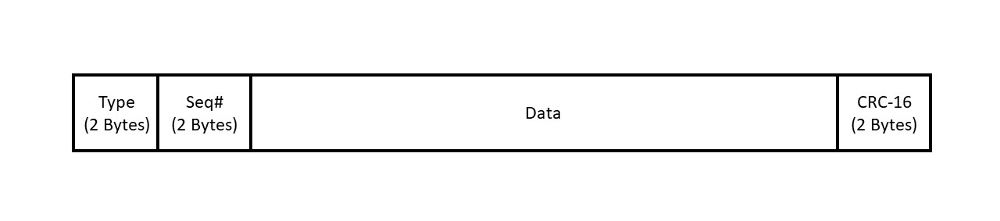

# ReliableSerial

This class is meant to implement reliable, in-order, non-duplicated communication over serial ports with similar methods and behavior to the Arduino Serial library. 

# Use:

Note: CRC assumes big-endian systems. This was corrected in the sending of packets. Undo this correction if your system is big-endian. No marshalling of data is done. If using opposite endian systems you must take this into account. 

## constructing
The constructor takes the port name. Baud rate is set automatically to 9600.

```
const char* portName = "\\\\.\\COM4";
arduino = new Serial(portName);
```

## print:
print is meant to mimic the Arduino library print. Currently it still needs to be overloaded to take types other than c strings. print returns to caller after the message has been successfully received by the other side. A timeout needs to be added.If the other side is not reading the it will hang. Returns true if successful and false if an error occurs. 
```
string message = "hello there, enjoy no zero termination!";
arduino->print(message);

```
## read:
Read also mimics the Arduino Serial library. It reads any available packets into the data buffer and returns a char containing the next byte from the data buffer.

## available: 
Same as Arduino Library. It checks for available packets and returns true if there is an available byte in the data buffer.
```dotnetcli
while(arduino->available()){
    cout << arduino->read() << endl;
}
```


# Todo:
There are a lot of small and significant things left to do.
1. Expand for Arduino and Linux. Currently this only runs on Windows. Ideally it could be run on arduino also and on Linux. 
1. Change the structure to better match the Arduino library
1. Better and safer structure. There are currently a few questionable mechanisms for doing things that can be hard to diagnose and may cause memory issues down the line. More robust choices could be made.
1. Timeouts need to be fixed. Timeouts are not quite working and have not been committed yet.
1. The mechanism for acks and nacks could be improved. See discussion below. 
1. Use multithreading to handle acknowledgments of data. As it is, the sender can only send a message when the other side's application is actively listening because it requires acknowledgments to be sent back. Multithreading could take care of that.
1. Fix data buffer. Currently unread data can be overwritten when the buffer wraps around. Flow control needs to be re-implemented either by advertising the window or by simply dropping packets that are not able to fit in the buffer. The serial port flow control does not work because packets must be continuously read to receive acknowledgments and negative acknowledgments.
1. Control messages. More control messages are needed. Particularly stuffed packets need to be indicated. Additional control packets such as changing windows, packet sizes, and baud rate would be good. 
1. Overloading print. Currently only strings can be printed. Other types need to be added. 

# Design and Experience:

This was one of the most involved projects I have made. It required a lot of thinking about how best to implement buffering, acks and nacks, crc, and more. Particularly how to implement it in c++ in the most safe and efficient way. I had to think through not only the working code seen here, but also try out and think about all the other possibilities. I had to prioritize making it work. Some decisions need to be made safer and some could be more efficient. There is a lot of direct handling of memory which is painful to debug and very easily causes corruption and leaks.

I started off with <a href="https://github.com/manashmandal/SerialPort">this</a> helpful basic library to understand the initialization and sending process for serial ports in windows. Everything else was from the ground up.Only the readfile and writefile commands, the header file structure, and initialization of the port were kept.

The CRC particularly is inefficient. For real use a CRC library would be beneficial but I developed my own for the experience. The bit shifting is very inefficient. Hardware would be much better suited for this task and perhaps there is a better way to do this in c++ or with a c library.

To effectively use crc the data was divided into packets. The packet size can be adjusted but the CRC must be changed accordingly to effectively detect errors. Currently it uses the CRC-16-CCITT code. The packets are of a fixed length for efficient processing and simplicity. The packet has a 2 byte type field, a two byte sequence field, a data field, and a two byte crc field for a CRC-16 remainder.



 Ack packets have type 1, nack packets type 2, and data packets type 3. A smaller type field could be used but would be far more inefficient and impractical to process for the amount of space it saves. The sequence field is used to keep packets in order in case a packet is dropped and to keep from having duplicate packets. A dropped packet is the only mechanism by which an out of order or duplicate packet will occur.

Packets are stuffed when insufficient data is present. Unlike TCP this the sending side does not treat data like a byte stream. It only has the explicit print method at which point it expects all data to be sent Thus there is no need to decide when to send packets. Stuffed packets need to be addressed still on the receive side.

I used <a href="https://book.systemsapproach.org/">this</a> resource to consider the sliding window approach, however it left a lot of implementation details out. Particularly, finding a way to keep track of which packets that arrived out of order proved a challenge. I tried a number of data structures to handle this but ultimately abandoned it because of efficiency. Unlike a network, this is operating over a single link. Packets should never be dropped over the link because of the built-in flow control and packets will only be out of order if they are corrupted and thus dropped. Since this is generally a very rare circumstance, I decided to simply drop all packets after an out of order packet and use a nack to invoke the resending of the packets starting at the dropped packet. This resending is far more efficient due to the rarity of the dropped packets, and the overhead of using data structures to keep track of the packets. I am sure there is some sneaky way it coud be done efficiently but I didn't have time to think of it. Additionally timeouts are not used in a strict sense. An ack of a later packet will implicitly acknowledge earlier packets and if nacks or acks are dropped for the last few packets, once it has sent all the packets it simply re-sends all packets after the last acknowledgment until an ack is received. Thus there is an implicit timeout that occurs after the sending process has sent all the packets. The downside of this is the nearly guaranteed resending of the last few packets on a high delay (long) link. Since no real timeouts occur it is far more efficient to use nacks to alert of failed packets instead of waiting for an implicit timeout at the end of the sending process. The current implementation however does not act on nacks until after the sending process. 
 
# Sources:

Basics of C++ and useful  online compiler for testing: 
<a href="https://www.w3schools.com/cpp/default.asp">Here</a>

Basic working of Windows serial ports:
<a href="https://docs.microsoft.com/en-us/previous-versions/ff802693(v=msdn.10)?redirectedfrom=MSDN">Here</a>


I copied the basic structure and a few pieces of code from this github by Manash Mandal. Almost everything was modified drastically. 
<a href="https://github.com/manashmandal/SerialPort">Here</a>

Ideas for how to handle acknowledgements and do CRC were from the networking book found <a href="https://book.systemsapproach.org/">here</a>.

More details on CRC can be found in these two videos by Ben Eater <a href="https://www.youtube.com/watch?v=izG7qT0EpBw&ab_channel=BenEater">here</a> and <a href="https://www.youtube.com/watch?v=sNkERQlK8j8&ab_channel=BenEater">here</a>